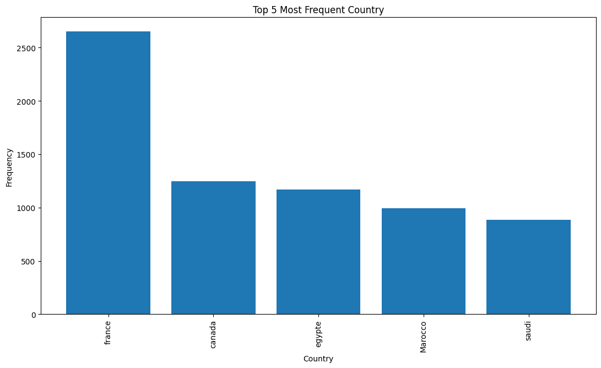

# Pandas-Data-Science-Tasks
Set of real world data science tasks completed using the Python Pandas,matplotlib,seaborn,numpy,glob,librarys.

## Setup

The other option is to click the green "clone or download" button and then click "Download ZIP". You then should extract all of the files to the location you want to edit your code.

Installing Jupyter Notebook: https://jupyter.readthedocs.io/en/latest/install.html  
Installing Pandas library: pip install pandas
Installing matplotlib library: pip install matplotlib
Installing glob library: pip install glob
## Background Information:

I use Python Pandas & Python Matplotlib to analyze and answer business questions about the most jobs posting by companies. The data contains hundreds of thousands of jobs posted in linkedin.

We start by cleaning our data. Tasks during this section include:
- Drop NaN values from DataFrame
- Removing rows based on a condition

To answer these questions bellow we walk through many different pandas & matplotlib methods. They include:
- Concatenating multiple csvs together to create a new DataFrame (pd.concat)
- Adding columns
- Parsing cells as strings to make new columns (.str)
- Using groupby to perform aggregate analysis
- Plotting bar charts and lines graphs to visualize our results
- Labeling our graphs

Once we have cleaned up our data a bit, we move the data exploration section. In this section we explore 11 high level business questions related to our data:
- What are the most frequent job positions in this list? 

- What are the most common locations for these jobs? 

- Which companies offer the most job postings in this list? 

- Which country is most represented in this list? 

- Are there specific job postings in certain fields, such as information technology or data analysis? 
- whish the best country how post for Data Analyst job ? 
